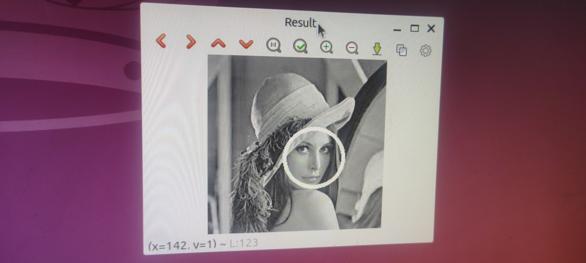
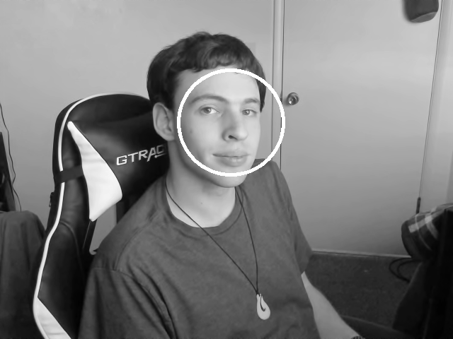
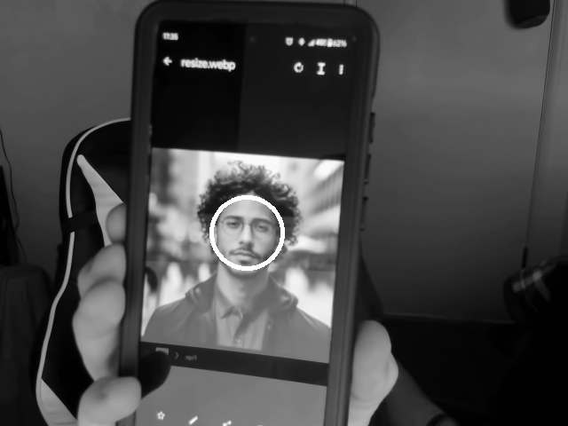

# OpenCV Facial Recognition
## Overview

This Project showcases facial recognition capabilities of openCV, using different haarcascade classifiers

## Hardware Used
This project relied primarily on a Raspberry Pi 4, running Ubuntu. This project also takes advantage of a webcam for live image recognition.

## Demonstration

Before modifying any of the base code, I tested its image capabilities:



Here, we see a picture with a woman's face circled by openCV.

Afterwards, I modified the program to take video input from my webcam (plus some more adjustments to compensate for my camera's high resolution, which was severely slowing down the program when running on a Raspberry Pi):



Here, we see a picture of me, captured from the application, appropriately circling my face.

To check the functionality further, I pulled a picture of a stranger up on my phone, and placed it in front of the webcam, to ensure the facial recognition worked on other things as well:



   

Next, notice how in this next picture, an extra circle appears on my shoulder:


This is an indication that the classification model may not be perfect. So, to address this, I decided to try several other models, some of which may be more strict than others.

To achieve this, I could have hard-coded the new classification when rebuilding the program, but instead, I decided to make it more dynamic. I started by modifying the findFace() function so it would be able to take a path to a classification as an argument:

```C++
void findFace(Mat image, char* path)
```

Next, I made two distinct calls to the function, based on how many arguments were passed into the program:

```C++
if (argc < 2){
    findFace(gray, "haarcascade_frontalface_default.xml");  // Default if no args are passed
}
else{
    findFace(gray, argv[1]); // passes argv[1] if available (first arg after program name/path)
}
```

In doing so, I made the program much more dynamic with how it recieved classifications for facial recognition.

With the new classification being used, "haarcascade_frontalface_alt.xml", notice how the program doesn't recognize my face until I'm looking more directly at the camera:


With this new more strict model, I am able to still recognize faces, without the odd artefacts of false positive recognitions. I also tried another model as well, "haarcascade_frontalface_alt2.xml", with its own unique results. Something I noticed was how the performance of the captures varied from model to model.


## Conclusion

OpenCV proved to be an efficient and effective method of facial recognition, which introduced me to principles that may be instrumental in my future endeavors, such as when working with small, or low-performance devices that may need to handle complex tasks that may involve object recognition, notably facial recognition in this case.
